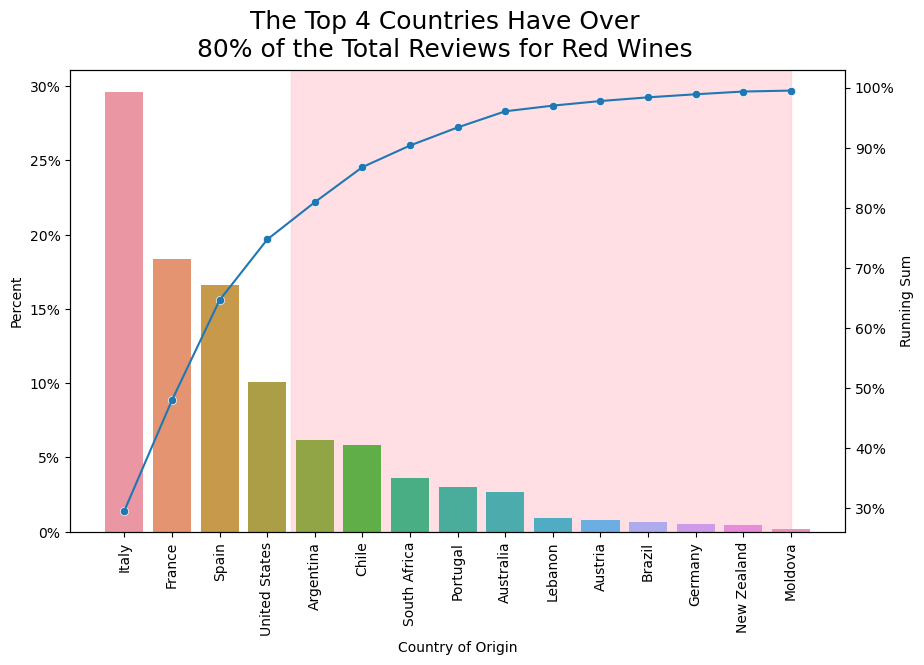
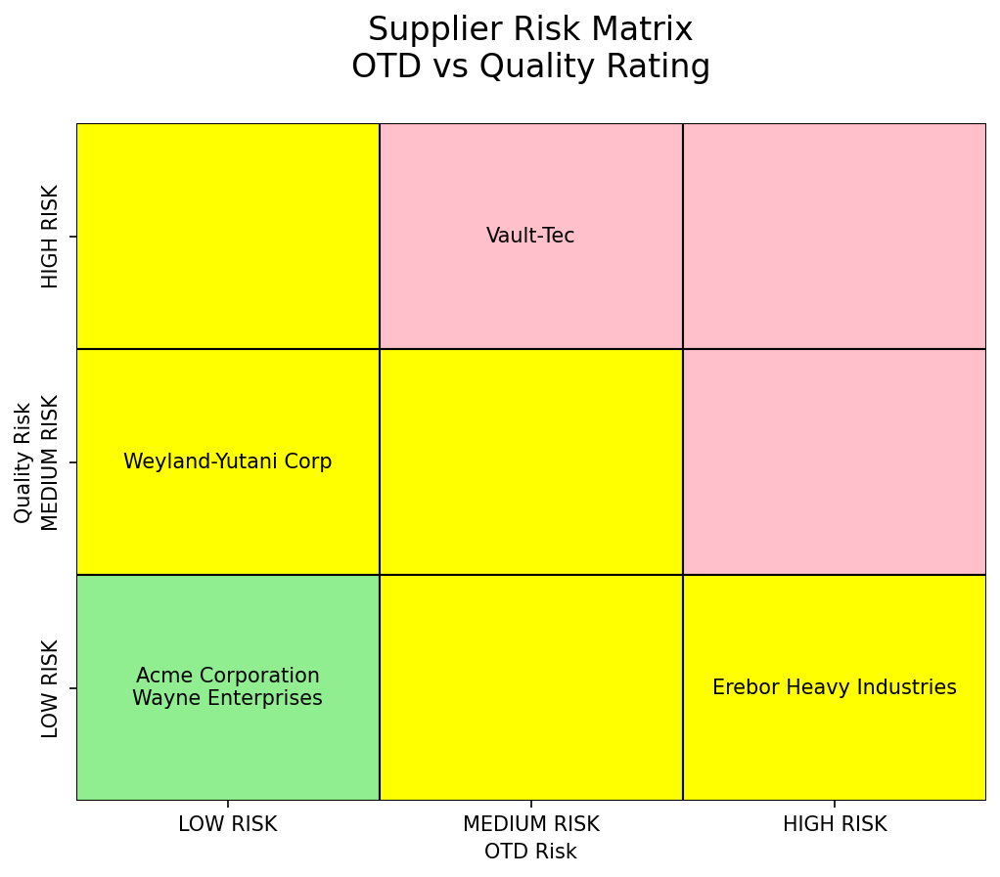

## Selected projects in data science, data analysis, and machine learning

### Are Wines From Popular Countries Rated Better?

We explored the question: If a country is popular, and receives more reviews, does it influence the average rating of its wine? Are the less popular countries rated lower? 

We applied statistical testing (e.g., Mann-Whitney and Rank-Signed tests) to check if any relationship exists, between popularity and ratings. 

And as a bonus, we proved that the type of wine for certain countries is rated more favorable than other types overall.

 
[![](https://img.shields.io/badge/Pandas-white?logo=data:image/png;base64,iVBORw0KGgoAAAANSUhEUgAAAMIAAAEDCAMAAABQ/CumAAAAeFBMVEX///8TB1QAAEb/ygDnBIgPAFLNzNYTAFnQ0NgMAFcAAETb2eP39/oUBlfV1N7/xwDmAID/9tfLydcjG17/4Yz//vbCwM3ykcL61OfoBIwyKmgAADYAAE0AAErx8PTIxdT/+un/34T85/Lyir/lAHv50eX+9fkpH2Ma8J+4AAACEklEQVR4nO3dzVIaQRSAUYNCEIGoiYmJivnP+79hFrmLVHELZ6pnmG483xqaPruh5lb32ZkkSZIkSZIkvb52z7dZU2+rT4uH2X6rx6m31afF7M1+87dTb6tPCDWEUEMINYRQQ5MS1tu0nqtMSrhKn26e1v1WmZawyn58g4DQL4QIoSyECKEshAihLIQIoSyECKEshAihLIQIoSyECKEshAihLIQIoSyECOFA6cvM5a4nYb29yjoO4WmVvM58WPQkbF8e+RqPcDlPVp4t+xLS/W0QEBCqI8yTLpsizN8n/WmJ0CEEBAQEBAQEBIT2CF+/fci6a4hw8y7rvC3CeRYCAgICAgICAgICAgICwlCEtJYIdzdp/3+kdkKHToFQ+RjJMCEcCKF7CAdC6B7CgRC6Nylh9zGtJUJ6uNCsnsOFhhkvPAHC9x+fsloi/Pp5nXTREuH++iLpMwICAgICAgICAgICAgKC/87R7/u0lggdQkBAQEBAQEB4dYQON67UTqh9KuwkDlRBQED4R8gOF5o3Rdh8yepLGO0ez6MNPO+WQ9w3NilhvBAihLIQIoSyECKEshAihLIQIoSyECKEshAihLIQIoSyECKEshAihLIQIoSyEKJt+lL0SNeADUR4TG9cGWXHew10AkPP4aRBO9ohEuOFUEMINYRQQwg1dAKEDvd41t5t2u7lL0qSJEmSJEnSyfUXeomSFq0EzbkAAAAASUVORK5CYII=)](#) 
 
 

[View Notebook on GitHub](https://github.com/JGundisalvus/portfolio/blob/main/wine_ratings/wine_analysis.ipynb)

---
 

### Prioritizing Supplier and Reducing Risk
Supplier performance was analyzed based on common metrics such as on-time delivery and defect rates.

By cross-referencing the performance metrics with product details, we identified two suppliers that posed significant risk to highly critical parts. 

We then developed a risk matrix to prioritize and mitigate risk from foremost supplier contributing the most risk to our business.

 
[![](https://img.shields.io/badge/Pandas-white?logo=data:image/png;base64,iVBORw0KGgoAAAANSUhEUgAAAMIAAAEDCAMAAABQ/CumAAAAeFBMVEX///8TB1QAAEb/ygDnBIgPAFLNzNYTAFnQ0NgMAFcAAETb2eP39/oUBlfV1N7/xwDmAID/9tfLydcjG17/4Yz//vbCwM3ykcL61OfoBIwyKmgAADYAAE0AAErx8PTIxdT/+un/34T85/Lyir/lAHv50eX+9fkpH2Ma8J+4AAACEklEQVR4nO3dzVIaQRSAUYNCEIGoiYmJivnP+79hFrmLVHELZ6pnmG483xqaPruh5lb32ZkkSZIkSZIkvb52z7dZU2+rT4uH2X6rx6m31afF7M1+87dTb6tPCDWEUEMINYRQQ5MS1tu0nqtMSrhKn26e1v1WmZawyn58g4DQL4QIoSyECKEshAihLIQIoSyECKEshAihLIQIoSyECKEshAihLIQIoSyECOFA6cvM5a4nYb29yjoO4WmVvM58WPQkbF8e+RqPcDlPVp4t+xLS/W0QEBCqI8yTLpsizN8n/WmJ0CEEBAQEBAQEBIT2CF+/fci6a4hw8y7rvC3CeRYCAgICAgICAgICAgICwlCEtJYIdzdp/3+kdkKHToFQ+RjJMCEcCKF7CAdC6B7CgRC6Nylh9zGtJUJ6uNCsnsOFhhkvPAHC9x+fsloi/Pp5nXTREuH++iLpMwICAgICAgICAgICAgKC/87R7/u0lggdQkBAQEBAQEB4dYQON67UTqh9KuwkDlRBQED4R8gOF5o3Rdh8yepLGO0ez6MNPO+WQ9w3NilhvBAihLIQIoSyECKEshAihLIQIoSyECKEshAihLIQIoSyECKEshAihLIQIoSyEKJt+lL0SNeADUR4TG9cGWXHew10AkPP4aRBO9ohEuOFUEMINYRQQwg1dAKEDvd41t5t2u7lL0qSJEmSJEnSyfUXeomSFq0EzbkAAAAASUVORK5CYII=)](#) 
 
 
 
 

[View Notebook on GitHub](https://github.com/JGundisalvus/portfolio/blob/main/supplier_performance/supplier_analysis.ipynb)

---